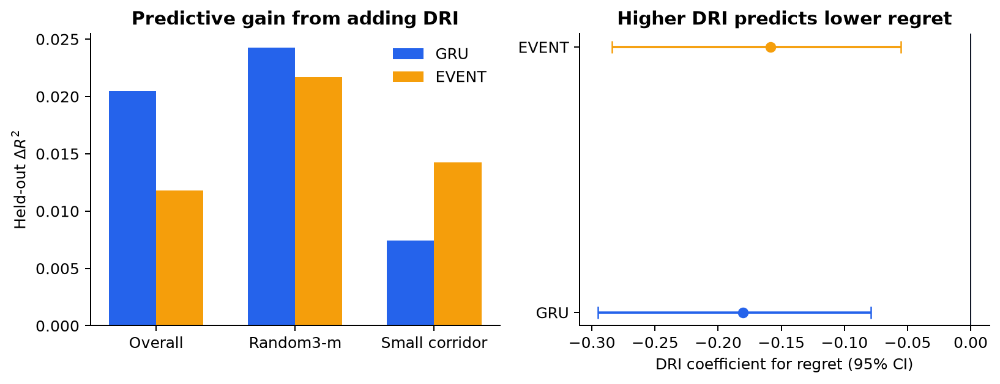
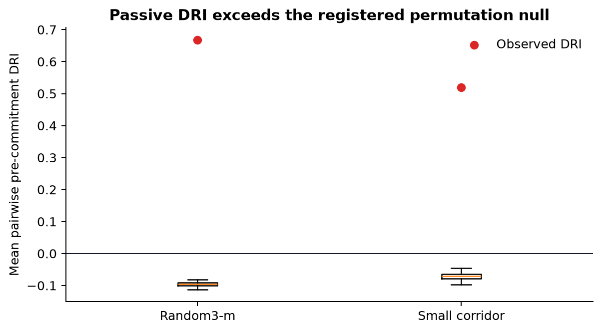
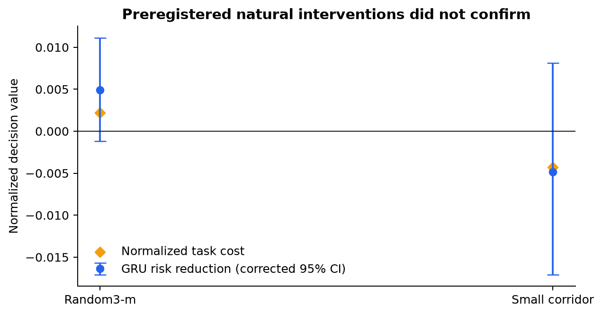

# Stage 6 Compact Results

These are the publication-facing outputs of the frozen Stage 6 v3 analysis.
They contain no raw traces, checkpoints, machine-specific paths, or row-level
predictions.

## Final result

**Verdict: `complete_measurement_only`.** Pre-commitment DRI adds aggregate
held-out predictive value in both official layouts. Neither frozen natural
intervention confirms.

| Primary GRU result | Overall | `random3_m` | `small_corridor` |
|---|---:|---:|---:|
| ΔR² | +0.02047 | +0.02426 | +0.007449 |
| ΔMAE | -0.003394 | -0.002199 | -0.001228 |
| ΔMSE | -0.001369 | -0.000896 | -0.000598 |

The adjusted DRI coefficient for regret is -0.18035, with clustered 95% CI
[-0.29499, -0.07918]. The event sensitivity has the same direction and
improves all three aggregate held-out metrics.

## Files

- `stage-6-summary.json`: compact machine-readable verdict, gates, and results.
- `predictive-value.csv`: primary and sensitivity regression summaries,
  including fold heterogeneity.
- `permutation-tests.csv`: observed statistics, null summaries, raw p-values,
  and Holm-adjusted p-values.
- `intervention-audit.csv`: intervention effects, corrected intervals, costs,
  response divergence, and final confirmation status.
- `artifact-manifest.json`: source and generated-file SHA-256 hashes.
- `figures/`: matching PDF and PNG publication figures.







## Reproduce the compact package

After the frozen row-level Stage 6 analysis has been reproduced locally:

```bash
uv run zsc-identifiability established official redesign publish \
  --input phase-6-established-validation/artifacts/official-measurement-v3 \
  --output phase-6-established-validation/results
```

The exporter refuses incomplete audits, failed calibration, a changed verdict,
or a disagreement in the registered regression direction. It emits only
path-safe summaries and hashes every source and generated file.
